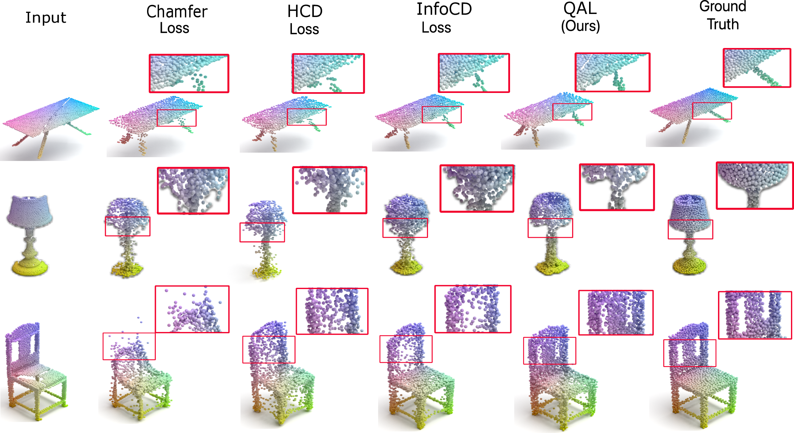
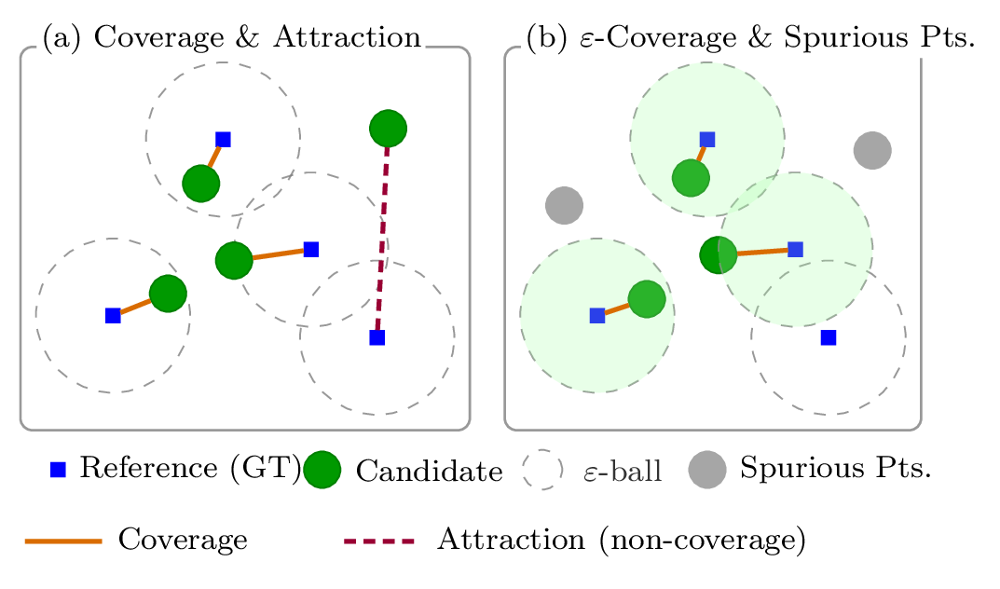

# Quality-Aware Loss (QAL)

**WACV 2025** | [Paper (arXiv:2511.17824)](https://arxiv.org/abs/2511.17824)

Official PyTorch implementation of *Quality-Aware Loss for 3D Point Cloud Completion*.

## Visual Preview

**Point-Cloud Completion.**  
  
QAL recovers thin structures while controlling spurious points.

**Qualitative Comparisons.**  
  
Side-by-side comparisons highlighting recall–precision balance versus CD/EMD.
<!-- 
**Training Dynamics.**  
  
Validation curves showing improved coverage metrics over traditional losses. -->

## How QAL Works

  
QAL combines a coverage-weighted nearest-neighbor term with a ground-truth attraction loss, enabling explicit recall–precision control compared with Chamfer/EMD.

## Status

🚧 **Code release in progress** – Expected: [April 2026]

QAL is a drop-in replacement for Chamfer Distance that improves coverage by +4.3 pts on average while recovering thin structures and under-represented regions.

**Star/Watch this repo for updates!**

## Citation

If you find this work helpful, please consider citing:
```bibtex
@article{meshram2025qal,
  title={QAL: A Loss for Recall--Precision Balance in 3D Reconstruction},
  author={Meshram, Pranay and Turkar, Yash and Singh, Kartikeya and Masilamani, Praveen Raj and Adhivarahan, Charuvahan and Dantu, Karthik},
  journal={arXiv preprint arXiv:2511.17824},
  year={2025}
}
```

**Note**: This will be updated to the WACV proceedings citation upon publication.

Contact: [pranaywa@buffalo.edu]
