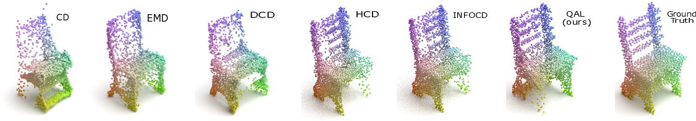
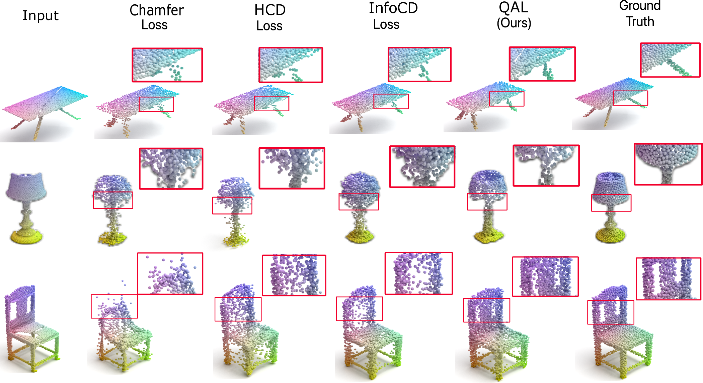
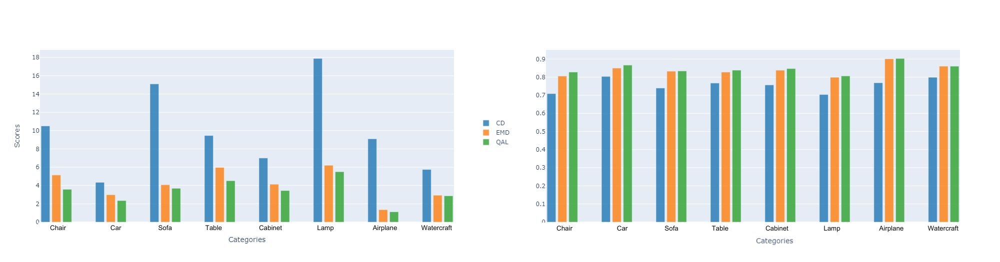
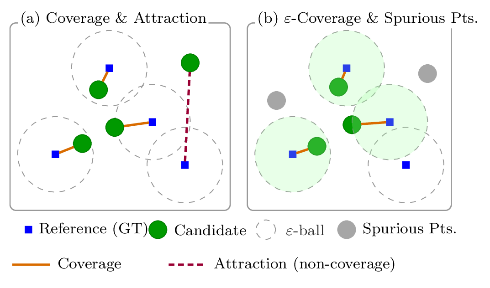

# Quality-Aware Loss (QAL)

**WACV 2025** | [Paper (arXiv:2511.17824)](https://arxiv.org/abs/2511.17824)

Official PyTorch implementation of *Quality-Aware Loss for 3D Point Cloud Completion*.

## Visual Preview

**Point-Cloud Completion.**  
  
QAL recovers thin structures while controlling spurious points.

**Qualitative Comparisons.**  
  
Side-by-side comparisons highlighting recall–precision balance versus CD/EMD.
<!-- 
**Training Dynamics.**  
  
Validation curves showing improved coverage metrics over traditional losses. -->

## How QAL Works

  
QAL combines a coverage-weighted nearest-neighbor term with a ground-truth attraction loss, enabling explicit recall–precision control compared with Chamfer/EMD.

## Minimal PyTorch Example

The self-contained [`scripts/qal_pipeline.py`](scripts/qal_pipeline.py) includes:

- the QAL objective from Algorithm 1;
- a tiny point-cloud completion network;
- synthetic paired point clouds for a quick smoke test;
- training, checkpoint loading, and evaluation with QAL, L1 Chamfer, and F-score.

Only PyTorch is required:

```bash
pip install torch
python scripts/qal_pipeline.py train
python scripts/qal_pipeline.py eval
```

The training command writes `minimal_qal.pt`. The evaluation command reloads
that checkpoint and evaluates the same held-out deterministic split.

### Use QAL in another model

Predictions and targets must be point-cloud tensors shaped
`[batch, number_of_points, 3]`. They may contain different numbers of points.

```python
from scripts.qal_pipeline import qal_loss

prediction = model(partial_cloud)
loss = qal_loss(
    prediction,
    target_cloud,
    eps=0.001,
    omega=10.0,
    attraction_weight=1.0,
)

optimizer.zero_grad()
loss.backward()
optimizer.step()
```

Use the training tolerance `eps=0.001` for the paper configuration. The example
reports F-score at a separate evaluation threshold of `0.03`.

## Status

The minimal QAL loss and runnable training/evaluation example are available in
[`scripts/`](scripts/). Full benchmark-specific integrations are still being
prepared for release.

QAL is a drop-in replacement for Chamfer Distance that improves coverage by +4.3 pts on average while recovering thin structures and under-represented regions.

**Star/Watch this repo for full benchmark updates!**

## Citation

If you find this work helpful, please consider citing:
```bibtex
@article{meshram2025qal,
  title={QAL: A Loss for Recall--Precision Balance in 3D Reconstruction},
  author={Meshram, Pranay and Turkar, Yash and Singh, Kartikeya and Masilamani, Praveen Raj and Adhivarahan, Charuvahan and Dantu, Karthik},
  journal={arXiv preprint arXiv:2511.17824},
  year={2025}
}
```

**Note**: This will be updated to the WACV proceedings citation upon publication.

Contact: [pranaywa@buffalo.edu]
